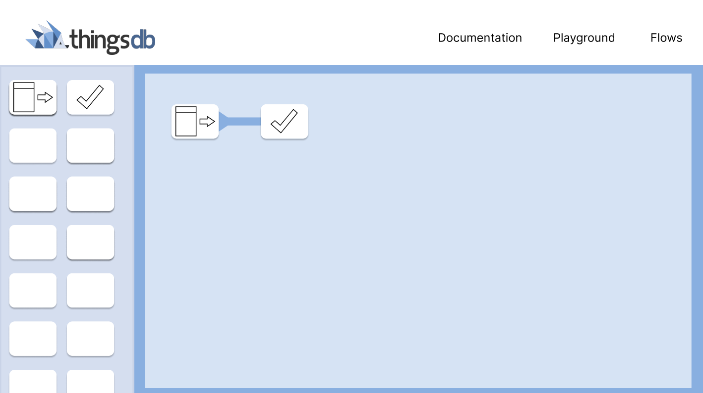
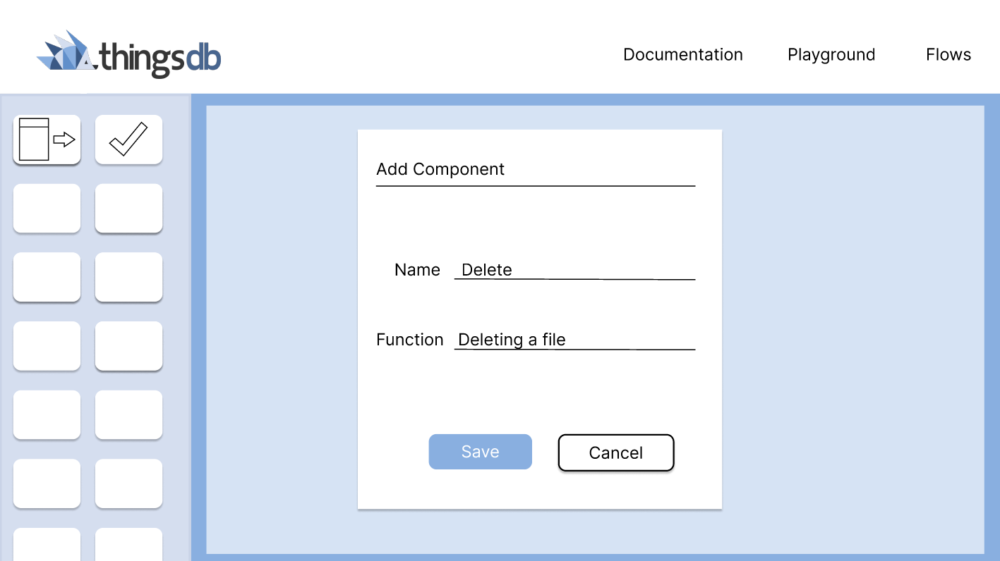
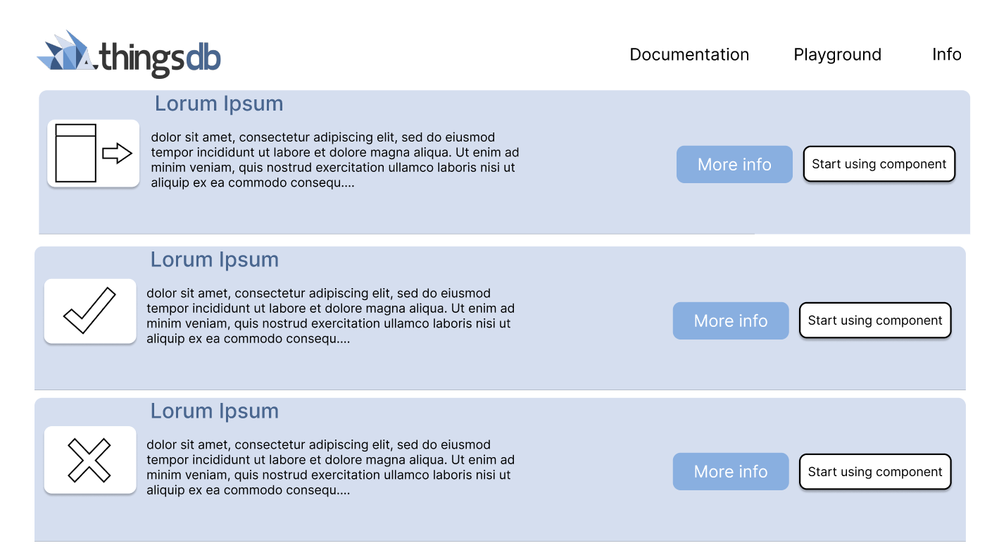

# The birth of an internship

## Survey

For the first sprint I found it important to get to know the company better, I spent most of my time getting more acquainted with my coworkers and stakeholders. I did this by making a [survey](uploads/fe6bfe46eb91219766094d8bedc8c238/Vragenlijst_Cesbit.pdf) for the company in which I asked questions about how the internship would go and more in depth questions about the project that I will be making. This gave me a much better insight and a more structured way of looking at my internship, it was also a fun way to get to know eachother.

## Research on ThingsFlow

I also started making a [research document](uploads/5b4dc45be38e584e31897731814bff68/Werking_Flow.pdf) on how the flow should work, I wanted to put this down on paper so it was clear for everyone included what I was supposed to make and how the things I will be making should work. I put this down together with Jeroen as he had more knowledge about the functionalities and a pretty clear idea on how he wanted it to look. 

## Project plan

Then I started with my [project plan](uploads/73b496acd3f468691ddc125976de4f1e/Projectplan_Daan_Matheeuwsen_V2.pdf), after I had done a few assignments I had made for myself and having a Q&A with my stakeholders I had a good idea on what I had to make for my project at the company, so I spent some of this sprints´ time making the project plan and having conversations with my stakeholders at the company and the tutor supervisor to see the project was also alligned with what the project owners and the school expected from me, after a lot of feedback I had finished this and I could go on with the next part of the project.

## Rivalry

After that I wanted to research the 'rivals' and what their pro's and cons were. I made this choice because I thought it would be very smart for me to look at other applications first before starting as this could give me some inspiration and more insight. One of the biggest flow tools application is Dovetail, so I made a [research document](uploads/35294606cdb4707ce7b672106d3fad6b/Research_Document_Dovetail_ENG.docx) for this studying their ways and trying to figure out where their disadvantages layed.

## Design time

At last I wanted to make some designs of how I wanted the flow tool to look, so I needed something where I could design in. My stakeholders at the company recommended me 'Figma' as they use it as well and they found it very convenient to make designs, so I started learning how Figma worked by following along tutorials of other people and by making little projects myself. When I started to get a hang of it I began with prototyping a Design for ThingsFlow. As the company had made a GUI for the back-end already I took their color pallet and started the begin of my design by taking inspiration from other flow tools. The fun thing about Figma is that you can make it interactive, when clicking on a specific component that you have designed you can go to the next frame. This was very useful for me as I could make an interactive flow as my first design. You can test the first prototype I have made right [here](https://www.figma.com/proto/X1ugwhMIqFoLcablj3Rcme/ThingsFlow_V1?node-id=32%3A606&scaling=scale-down&page-id=0%3A1&starting-point-node-id=1%3A46&show-proto-sidebar=1).

## Retrospective
When looking back at this sprint I had finished more than I had expected I'd finish, I was very happy with what I have made this sprint as I was pretty stressed I didn't know where to start and I'd end up not finishing anything. Luckily I got some really good help from my stakeholders giving me a starting point with the Q&A I did. I set my mind right and really did my best making something that I could be proud of.   
When asking for feedback from the stakeholders they were very happy with the researches and prototypes that I had delivered, and they were very surprised that I had come so far in just two weeks. There wasn't really something yet that could be done differently as there hasn't gone much time over the project, and everything went pretty good. So for the feedforward we had concluded to keep it up, and to follow the work ethic that I had deliverd this sprint. 
