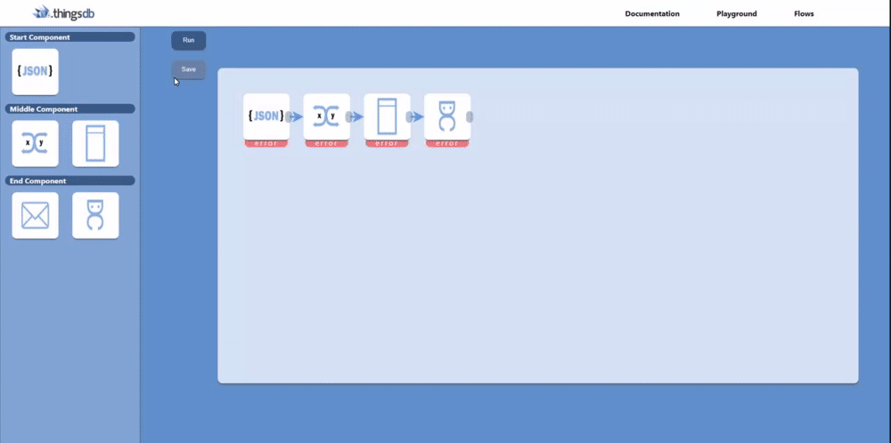
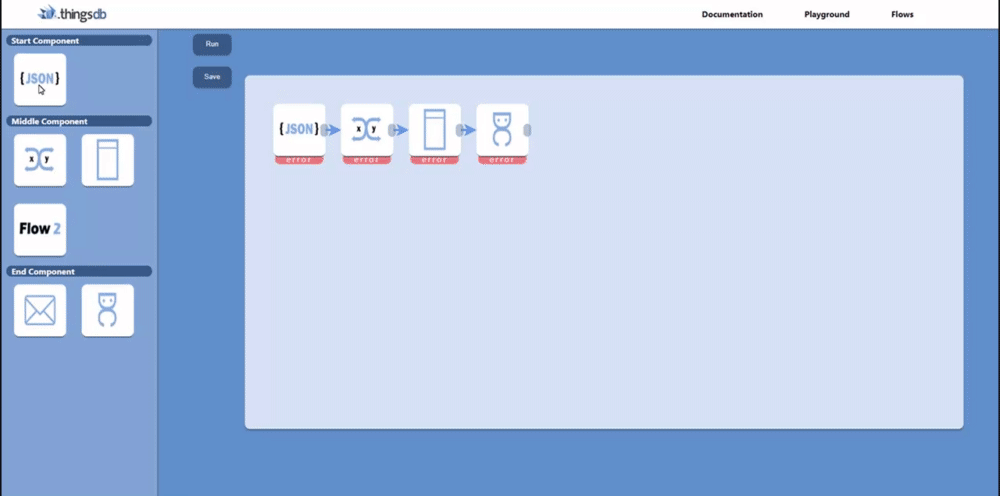
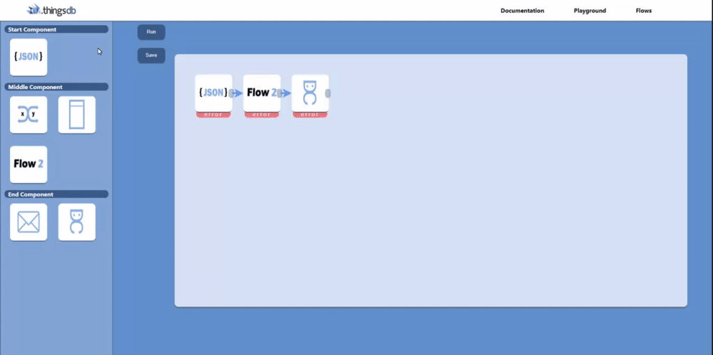
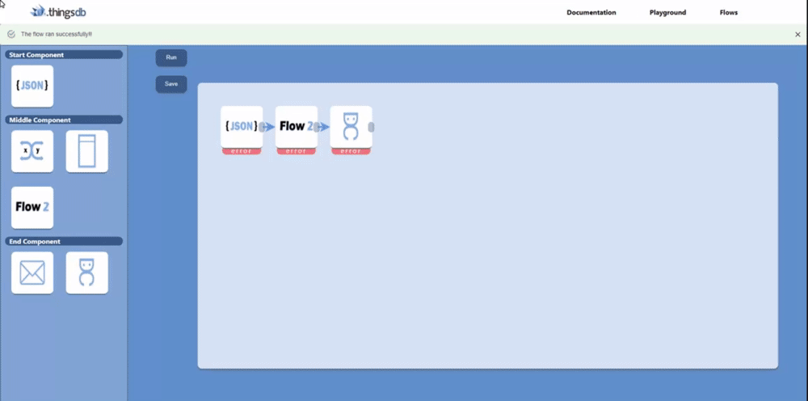

## Adding actual functionalities 
When I had figured out the multiplying application I thought it was time to make some components that could talk to eachother that actually could be used for the actual ThingsFlow application. So I started tinkering what could be a convenient route to make for this sprint that was achievable but still very cool to make. After some sketching and conversations with my stakeholders I came up with a 3 step flow that converts a JSON file to a [DutyCalls](uploads/7188a61e3307e8a5105d172f7000c0eb/DutyCalls.pdf) mail. We decided to to this step as this is one of the most default functionalities that should be in there and the stakeholders thought it would be very cool if it could make a link with DutyCalls as this is one of their projects as well. I made a video on the functionality to showcase it better, you can find the video by clicking on the following link; https://youtu.be/gw4G_18yKQ8

## Back to designing
When I was done creating this functionality I sat down with my stakeholder Jeroen, we had a chat on what would be wise to continue on now. I told him I had some few more components in mind that I could make but he came with a very good view that this wouldn´t be necessary, as he believes that these components could work but he wanted to see more functionalities, in particular a flow that could be reusable. I agreed with the idea that there should be other functionalities instead of more components and I also liked the idea of the reusable flows so this was the first thing on the agenda. I sat back and decided that I needed a design for a reusable flow, designs for how you could save it and how the component itself could look. So I made a [research document](uploads/ef1f128ee3a119d223bbefa5ffdfc6ae/Save_and_reuse_a_flow.docx) answering these questions. This docment really gave me a good preparation before I started prototyping the actual reusable flow, so it was a very good idea to write this document first.

## Reusable flows
When the designing process was done I started with the prototype, before I started making this prototype i started sketching how it should work so I'd get a better view on how it should work functional wise. Pretty fast I got the hang of it and I didn't need to sketch any further as I got the confidence I could make it as a prototype; 

-------

-------

Then I started working on saving a flow, I had to think about what should be saved inside the flow so the correct information could be used in the backend. All of the information that had been filled in should be saved when making a component so you don't have to do that tidy work so this was kind of a challenge. But as you can see I made the function so you can save a flow as a component; 

-------

-------

After that I started making the functionality so that it actually works, first I thought there wouldn't be any problems because it'll just go through the component with the given functionalities but it didn't work like that, so I had to write a different function for this component that goes through all the functionalities that it contains. With some hard work and trial and error I'd managed to fix it and make it work as follows;

-------

-------

## Retrospective
When sitting down with my stakeholders of the company we first reviewed what I had made, I did this by sharing my screen on a big TV and going through the steps that I had made. The first reaction was very positive, they were very surprised by the way I made the functionality to reuse flows the way I did it and found it very smart. They thought that I had come pretty far and they were happy with what I had made. 
 For the feedforward they had a few functionalities in mind that they still wanted to see how it would work, the error handling and the configuration was a very important functionality and they would like to see how I would create this in the next sprint. They also mentioned that they wanted me to make a final design in Figma later on and asked if I had this in mind as well. One stakeholder also mentioned that the design of the prototype that I made wasn´t really the same as the one in Figma, with the additional question if this was on purpose or if this was intentionally done. In this sprint there was again mentioned that I shouldn´t keep lingering on the same problem and that I really should ask questions if I need help, they eagerly told me that there are no dumb questions and that they are all very open and glad to help me in this project and that I shouldn´t feel ashamed to ask a question when needed. 