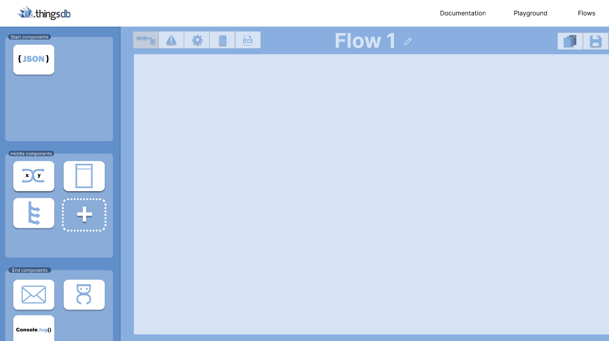

## Before the sprint
When setting up this sprint we sat together again as we do every sprint, we reviewed the last sprint and now we needed to find out what we wanted to do for the upcoming sprint. The three of us had the idea that I had come pretty far with the functionalities in the prototype but there were still a few functionalities that they wanted to know how it would look. I offered the idea to start designing a complete functional design in Figma, as they found it more important how it would look rather than how it would function I thought this was a good idea. They agreed with this and gave me a few functionalities that they would really like to see in this design and this gave me a few directives which I could hold on to while making the design in Figma. I chose to make the design in Figma as I had made designs for this project earlier on in Figma and I was pretty comfortable with this already, and it is just a very easy platform to make designs and make them 'talk' with eachother.

## Start of a new design
When I began I wanted to make the design that I had a bit more new, As I found that the old design was a bit old and boring I wanted to give it a more sleek design, a few things that I wanted to change was the sidebar, the header and the components itself.
I wanted to change the sidebar as it looked a bit random and it wasn't as slick as I wanted.
I also wanted to change the header as it took much space which wasn't needed, it created a lot of white space.
And lastly I wanted to change the design of the components as I had made a few components in my prototype already these could be used already but I also wanted to change the error handling.
With all these in mind I created my first design of this sprint which looked as the following; 

## Functionalities the stakeholders wanted to see
As mentioned earlier there were a few functionalities that the stakeholders wanted to see in the design, as they didn't know if it was still possible in the time that I had in this internship. The things that they found important was; 
* How you would see, use and configure the error handling
* How the errors would be handled inside the flow, and with what kind of ways
* How configuration with other applications, such as DutyCalls or Mail, would look like
* How the switch cases would work
* Maybe some own input

You can find the whole design and the things that I made here: [figma design](https://www.figma.com/proto/RIRckga4ygXjIpYMYyj278/ThingsFlow?node-id=425%3A3202&scaling=scale-down&page-id=0%3A1&starting-point-node-id=425%3A3202&show-proto-sidebar=1)