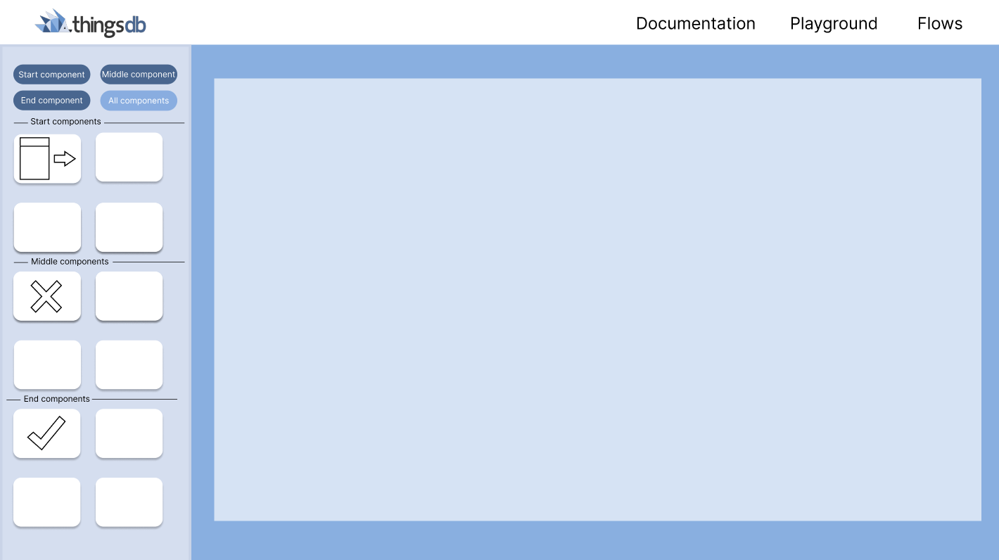
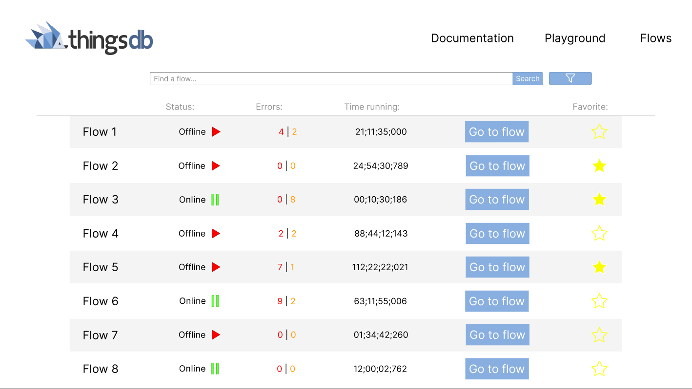

## The laws

When first making the design in Figma I made it based on comparing to other flow tools and bij using the color palet from the ThingsDB GUI of the backend. But I wanted to research if there were any psychological reasonings behind certain ways of making a project. That's why I made a research document on [the laws of UX](uploads/b641b0df00c96b4e92715680b5628d7e/The_laws_of_UX.pdf), this gave me a much better insight on designing with underlying meaning and the best practice way to make certain designs. I also made another document because I found more about [best practices in UX designing](uploads/88eb7f34f8cb1ac93ee7b99ab7cb0794/UXBestPractice.pdf), so I wanted to document this as well. 
 Both these documents really gave me a better understanding on UX designing and really helped me this internship making and designing with a purpose. I really think the user experience got better with these documents and this will definitely help me in the future as well

## Researching the platform
Because I didn't really have an understanding of the back-end yet I wanted to make a [research document](uploads/bcceeb817e923ca09873eb76fe138cf9/Research_ThingsDB.pdf) on this as well, where I'd figure out how to work with ThingsDB and along the way write down the stuff that I encounter, this really helped me get to know the platform better and while writing down how to set it up it alsof gave me a reminder on how to do so if I would forget how to. In this document I have written down all the specific things that is provided in ThingsDB and I also tested specific functionalities to see if I got the hang of it. 

## Is it possible?
After I got the hang of ThingsDB itself I wanted to find out if it is even possible to make a flow tool on top of ThingsDB, this was a very important question to ask and solve because if this came out as negative I would have to switch up my whole project and make a different one. Because my stakeholder was so positive it was possible it gave me a confidence boost that it would be, and so it didn't stress me out a lot that there was a possibility it wouldn't work. In the [research document](uploads/fbf1a80ca6cce6a318288d58c962dd0c/Is_it_possible_to_make_a_Flow_tool_by_using_ThingsDB.pdf) I did several researches based on various of methods so I could reassure that it is indeed possible to make a flow tool on top of ThingsDB. 

## Duty calls me
In a reseach I have done in sprint 0 I had stated together with my stakeholders that for the errors they would like to have DutyCalls as a way of handling this. I can hear you thinking; "What is ThingsDB?". For that reason I have made a [document](uploads/b92805cce1657fd51b43abbec45abcc0/DutyCalls.pdf) that describes DutyCalls and what its involvement is in my project. 

## An introduction of yours truly
At this point in time my stakeholder Rik really wanted to introduce me on their LinkedIn, he wanted to let people know that I joined their family as an intern and he wanted to share the designs that I had made already. So I started writing down my [introduction](https://git.fhict.nl/I465040/cesbitportfolio/-/wikis/introduction) and a few days later it was posted to the LinkedIn of Rik. You can find the text right [here](https://www.linkedin.com/pulse/introducing-daan-matheeuwsen-cesbit/?trackingId=%2Bpgdj3bTAnyqLzTVWhEW6Q%3D%3D)

## Figma designing
When I finished all of these assignments I had set up I started working on my figma design again, as it wasn´t really finished and with the knowledge I had made up this sprint I knew that there would probably be a few mistakes considering the laws of UX design. So I started redesigning and adding new functionalities to my figma design. I added a new page where you could see all the flows with given information on it. I also redesigned the flow tool by adding beginning, middle and end components, and some other minor changes. Again these designs are interactive and you can play with them as almost everything is clickable. If you want to see the prototype I have made you can click [here](https://www.figma.com/proto/kVwhi19aRNdfD4cNUXJDl9/ThingsFlow_V2?node-id=86%3A1336&scaling=scale-down&page-id=0%3A1&starting-point-node-id=1%3A46&show-proto-sidebar=1)

## Retrospective
If we look back at the sprint and what I wanted to finish I can gladly say that I finished the things I wanted to finish for this sprint, and even more. For this sprint I had in mind to get to know ThingsDB better and get better insight on UX design. So I can say that I did a good this sprint and I need to keep up the work. For next sprint I want to start making a prototype, to get to know the feeling of the flow tool better and to know how I want to put the functionality together. 
The stakeholders were really pleased with what I made, they thought I did a good job with both writing the research and making designs. They thought the designs started to look really nice and they liked that I kept the color pallet of the back-end. Until now they didn't have any feedforward and they just want me to keep on going and are looking forward to the prototype that I will be building upcoming sprint