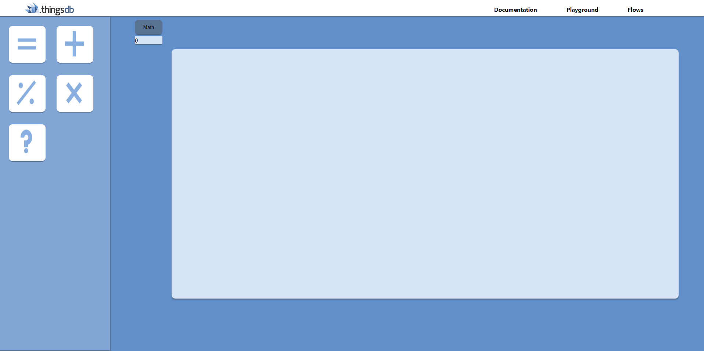
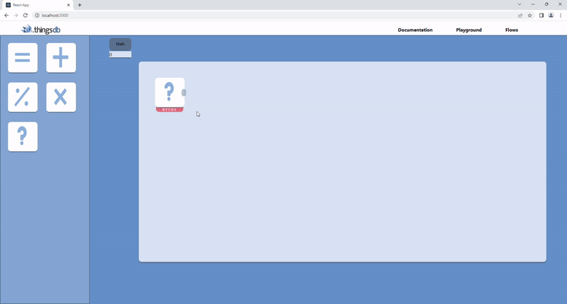
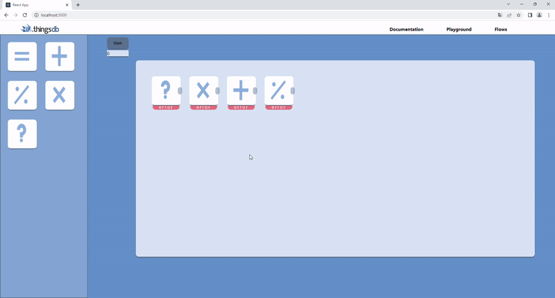
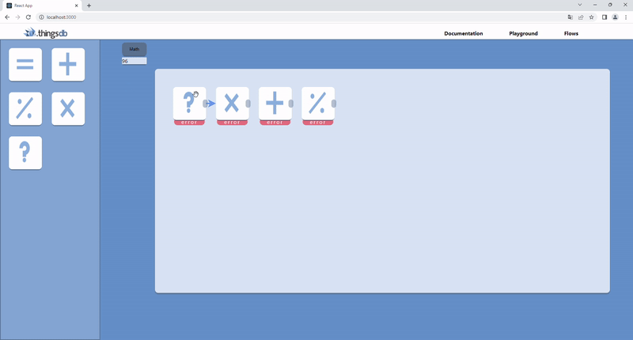

## Continuing the good prototyping spirit
Because the prototyping part was going pretty well I wanted to continue working on this.  
First of all I fixed the design a little bit with the feedback I got, I made the header and I fixed the look of the components that are visible on the board.  Then I wanted to showcase that you could make a working flow, in which the components talk with eachother and actually send their data to eachother and manipulate it the way it says it should. I wanted to do this because I wanted to know myself how this could work as I had no idea yet how I wanted to do this part. So I started sketching ways it could be possible on a notepad. After I did some tinkering and sketching I thought the easiest way to make this was to make a calculator, with each component having its own characteristic such as subtract, divide, multiply and sum. So I removed all the components from the sidebar that I already had and made a list of objects in the backend that could be used to for this idea I had in mind. This wasn't that easy of a task but because I had already done some sketching and brainstorming before this really helped me with the set-up of the back-end and front-end

Then I needed to figure out a way to let the components that you drag in talk to eachother, this was a big problem. I had tried many ways to do this, but it kept giving me more and more errors. I wanted to fix this myself as I thought I was super close to the solution and just needed to fix one more error to solve the problem that I had so I kept trying and trying but I kept digging a deeper hole for myself. Eventually my stakeholder noticed that I didn't really make progress the way I wanted to, as I verbally told them that I kept having errors. So he gave me the advice that I should just ask if I really didn´t know what I should do anymore, so eventually I did ask my stakeholder for help. He looked at my code together with me and gave me a whole different perspective on how a function could be made, then he gave ma a snippet of the code and how it could be made. This gave me a whole new way of thinking and it inspired me a lot and gave me a new boost of energy to fix this. Because of this I finally fixed the calculating system and I finally had the knowledge on how a flow tool could possibly be made. 

### How does it work
To make the calculation work you need to drag the question mark component in first, this is the component where you fill in the first value that you will be working with. When pressing on the component you get a modal, this modal gives information about the components and you also get a form where you can fill in a value. when pressing save the component also shows the saved component.
 

 
The rest of the components can be dragged in after the first component just the way you like it, you can fill in the rest of the values the way you want to. This way you can literally calculate simple equations by dragging the components inside them. But when pressing the math button you notice that no answer will be shown, why doesn't my calculation work?

 
This is because you haven't connected the components with eachother, because the system doesn't know which components need to talk to which you need to connect them with the arrows. I made the function that you can simply connect them by pressing the right part that goes dark when you hover over it, when pressing both the components you want to connect an arrow appears between them. As you can see in the example down below only the first two will be calculated. The 12 * 8 I filled in gets calculated which results in 96, as shown.

 
You can see when you start connecting them one by one that the system includes the component that has been added to the calculation. As shown down below;
 

## Taking a step back
With all this prototyping I decided that it was time to set a pause to it and take a little step back, as I was going through the prototyping I had made an idea myself on how things should work and how things should look. That´s when I decided that I should take a look at other applications and see how these were made so I can take inspiration off of it and maybe it could change my way of thinking. Momentarily we only had one way in mind to set it up but we thought it would be much better to find out more ways it could be done so we don´t work ourselves in a big hole when it ends up not looking/working the way we wanted it to. So I started looking at different applications that also worked with automatization and how they set up their page and I wrote down how it worked and how it looked, this really helped and reset my mind a bit and stopped me from thinking in one certain way to reacht my goal. 

## retrospective
When looking back at this sprint the stakeholders and I came to the conclusion that I shouldn't keep on tinkering about a problem for the time that I did in this sprint. This took a lot of time and when asking feedback my problem was solved in less than half of a workday, this could've saved me a lot of time. I really thought that I could solve this error myself as I thought that I was very close so I didn't really think about asking for feedback but sometimes it is better to get a fresh interpretation from someone else. Furthermore the stakeholders thought I found a really good way to showcase the working of a floow with a calculator and found it very clever that I thought of this.  
For the next sprint I need to keep in mind to not linger on the same problem for too long and I need to ask feedback or help earlier on, as this will probably save me a lot of time in the future.